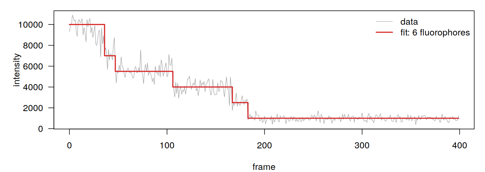

# photobleach — photobleaching step counter for R

Counts how many fluorescent molecules sit in a single diffraction-limited spot by finding the photobleaching steps in its intensity trace. The package processes many traces in one run.

This is the R port of [photobleach-step-counter](https://github.com/bingzhi-wang/photobleach-step-counter) (Python). It gives **results identical to the Python version**, frame for frame, and needs nothing beyond base R.


*A synthetic trace with 6 fluorophores. Two of them bleach in the same frame (the double step near frame 36), and the fit still recovers the correct count.*

## The problem

In single-molecule fluorescence imaging, one spot can hold one labelled protein or several, and that number (the stoichiometry) matters biologically. It tells you, for example, whether a protein forms dimers, oligomers or clusters. A common way to measure it is to illuminate the spot until every fluorophore has bleached. Each bleaching event makes the intensity drop by one discrete step, so counting the steps gives the number of fluorophores.

Counting those steps reliably is harder than it looks:

- **The noise grows with the signal.** The variance increases with the number of active fluorophores, so early steps are buried in noise.
- **Steps overlap.** Two or three fluorophores can bleach within the same camera frame, which produces one large step instead of several small ones.
- **Fluorophores blink.** A dye can switch back on briefly, which adds upward steps.
- **Data sets are large.** One experiment yields dozens to hundreds of trajectories, far too many to count by eye without bias.

Tsekouras *et al.* (2016) solved the statistical part with a Bayesian model-selection method. It scores candidate step arrangements with a modified Schwarz Information Criterion (mSIC), whose prior explicitly accounts for how unlikely overlapping events are. The authors released their code, which handles one trace at a time.

## What this project does

During my internship I adapted that algorithm to our group's single-molecule imaging data. That data comes as many intensity trajectories exported from Igor Pro, one trajectory per column. I contributed the resulting analysis script to Huber *et al.* (2024), where it is mentioned in the acknowledgements. This package brings the same tool to R.

Compared with the original code, this version:

- **Runs in batch.** It loads a whole file of trajectories, analyses each one and writes a per-trajectory result, a summary table and histograms of fluorophore counts and single-fluorophore brightness.
- **Sets the priors interactively.** The algorithm needs the background level, the brightness of one fluorophore and the rough position of the last bleaching step. On real, noisy traces the automatic estimate in the original code (a Kalafut–Visscher pre-fit) was slow and unreliable. Here you click on each trace instead. The clicks are saved to `priors.csv`, so a re-run with different settings needs no clicking.
- **Is fast.** The step search is vectorised with prefix sums and a cached prior. A batch of 20 traces of 400 frames takes about 2 seconds.
- **Depends only on base R.** No packages to install beyond `photobleach` itself.
- **Is simplified and annotated.** Every source file explains the part of the method it implements.

## How it works

For each trajectory:

1. **Priors from your clicks:** the frame of the last bleaching step, a background stretch (giving `mB` and `vB`) and a single-fluorophore stretch (giving `mF` and `vF`).
2. **Time reversal:** the trace is reversed, so it starts at the background level and fluorophores "switch on" one by one.
3. **Model:** with *n* fluorophores active, intensity ~ Normal(`mB + n·mF`, `vB + n·vF`).
4. **Windowed step search:** the trace is split into windows (default 100 frames). In each window the mSIC is minimised over step arrangements. The search first tries every placement of one or two steps of size ±1 to ±3, then keeps adding the single best extra step for as long as that lowers the score. The fluorophore count at the end of one window is carried into the next.
5. **Photobleaching-rate prior:** a rough bleaching rate, estimated from the trace, enters the prior on the number of steps.
6. **Output:** the maximum number of simultaneously active fluorophores is the stoichiometry of the spot.

## Installation

Install from GitHub (requires R ≥ 4.0):

```r
# install.packages("remotes")
remotes::install_github("bingzhi-wang/photobleach-step-counter-R")
```

Or clone the repository and install locally:

```bash
git clone https://github.com/bingzhi-wang/photobleach-step-counter-R.git
R CMD INSTALL photobleach-step-counter-R
```

## Usage

### Try it on synthetic data first

This needs no clicking, because the true priors are supplied with the package:

```r
library(photobleach)

traces <- system.file("extdata", "synthetic_traces.txt", package = "photobleach")
priors <- system.file("extdata", "synthetic_priors.csv", package = "photobleach")

summary <- run_batch(traces, outdir = "results", priors = priors)
plot_fit("results/traj_011.csv")
```

You can also generate new synthetic traces with a known answer:

```r
sim <- simulate_traces(n_traj = 20, outdir = "my_synthetic")
```

### Your own data

Put the traces in a text file with one trajectory per column and one frame per row (whitespace-separated, no header), then run from an interactive R session (R console, RStudio, R.app):

```r
library(photobleach)
run_batch("my_traces.txt", outdir = "results")
```

A plot opens for each trajectory. Left-click 5 points:

1. the last bleaching step (where the trace drops to background for good);
2. and 3. the start and end of a background stretch;
4. and 5. the start and end of a stretch where exactly one fluorophore is on.

After the fifth click, press **Enter** in the console to accept, **r** to redo the clicks, or **s** to skip the trajectory. Right-click (in RStudio: **Esc** or the *Finish* button) skips a trajectory straight away.

Re-run later without clicking, for example with a smaller window:

```r
run_batch("my_traces.txt", outdir = "results_w50", priors = "results/priors.csv", window = 50)
```

Analyse only some trajectories (indices are 0-based, as in the output file names):

```r
run_batch("my_traces.txt", outdir = "results", priors = "results/priors.csv", only = c(0, 4, 7))
```

### A single trace

```r
p   <- priors(t_last = 183, mB = 1000, vB = 62500, mF = 1500, vF = 185000)
res <- count_steps(trace, p, window = 100)
res$n_fluorophores   # stoichiometry of the spot
res$steps            # >0: that many fluorophores bleached at this frame, <0: blinking
```

### Command line

The repository also contains a script that runs without installing the package:

```bash
Rscript count_photobleaching.R my_traces.txt -o results
Rscript count_photobleaching.R my_traces.txt -o results_w50 --priors results/priors.csv -w 50
Rscript count_photobleaching.R my_traces.txt -o results --priors results/priors.csv --only 0 4 7
```

When clicking from the command line, the script opens a Quartz (macOS), Windows or X11 window. Re-runs with `--priors` need no display at all, so they also work on a server.

### Output

| File | Content |
|---|---|
| `traj_XXX.csv` | per frame: `intensity`, `active_fluorophores`, `step` (>0: that many fluorophores bleached, <0: blinking), `fit` |
| `summary.csv` | per trajectory: `n_fluorophores`, `n_steps`, `mB`, `vB`, `mF`, `vF` |
| `priors.csv` | your clicks, reusable with `priors =` / `--priors` |
| `histograms.png` | distribution of fluorophore counts and of single-fluorophore brightness |

Trajectory indices and frame numbers are 0-based, so `priors.csv` files are interchangeable between the R and Python versions.

### Tuning

The **window size** (`window` / `-w`) is the most important parameter:

- Windows that are too large miss closely spaced steps.
- Windows that are too small give a noisy, "brush-like" fit.

Try it on a few representative traces before running a whole data set. Two further settings are R options:

```r
options(photobleach.gamma0 = 0.5)          # prior cut-off gamma_0 (default 0.5)
options(photobleach.max_extra_steps = 9)   # greedy rounds per window (default 9)
```

## Validation

- **Against the Python version:** on the 20 synthetic traces in `inst/extdata`, every per-frame result file (`traj_XXX.csv`) is byte-identical to the Python output, at window sizes 37, 50, 100 and 150. The Python version was itself checked against the original `mSICer` on 60 windows from real trajectories.
- **On synthetic data:** for the 20 shipped traces with 1–6 fluorophores, including simultaneous bleaching, 19 counts are exact and all 20 are within ±1. On 20 new traces from `simulate_traces()` all 20 are exact.
- **Tests:** `R CMD check` runs the unit tests in `tests/testthat`.

## Repository structure

```
DESCRIPTION, NAMESPACE      R package metadata
R/
    msic.R                  mSIC step search in one window (Step 3 of Tsekouras et al.)
    rate_prior.R            photobleaching-rate estimate used in the prior
    pipeline.R              one trajectory end to end: pad, reverse, windowed search
    batch.R                 batch run: priors (clicking / CSV), outputs, histograms
    plot.R                  plot a trace with its fitted steps
    simulate.R              synthetic traces with known fluorophore numbers
count_photobleaching.R      command-line script
inst/extdata/               synthetic example traces, true priors and ground truth
man/                        function documentation (generated with roxygen2)
tests/testthat/             unit tests
```

The experimental data from the study are not included in this repository.

## License

This project is derived from code © 2015 Konstantinos Tsekouras and Sina Jazani, released under the GNU General Public License v3. It is distributed under the same license; see `LICENSE`.

## References

If you use this code, please cite the original method:

1. Tsekouras K, Custer TC, Jashnsaz H, Walter NG, Pressé S. A novel method to accurately locate and count large numbers of steps by photobleaching. *Mol Biol Cell.* 2016 Nov 7;27(22):3601–3615. doi: [10.1091/mbc.E16-06-0404](https://doi.org/10.1091/mbc.E16-06-0404). Epub 2016 Sep 21. PMID: 27654946; PMCID: PMC5221592.
   *The step-finding algorithm and original script that this project adapts.*

2. Huber J, Tanasie N-L, Zernia S, Stigler J. Single-molecule imaging reveals a direct role of CTCF's zinc fingers in SA interaction and cluster-dependent RNA recruitment. *Nucleic Acids Res.* 2024 Jun 24;52(11):6490–6506. doi: [10.1093/nar/gkae391](https://doi.org/10.1093/nar/gkae391).
   *The study I contributed this analysis script to (acknowledged in the paper).*
